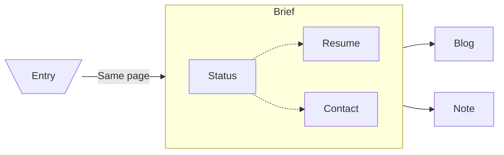

# README

This repository is a Hybrid WEB application for career resume and personal notes. The core ideal is to attract potential employers. The flow would be:

Server Side services are not included in this graph and should be done after Client Side.

The URL for this application should be available on **LinkedIn**, **GitHub**, and **Handshake**. Information from Brief section should also be synchronized through the all media.

## Client Side

Including Brief, Blog, and Note sections, basically all content. This is due to the desire of extending the limit from only text and images to a whole customized view. However, there will still be common components or style for consistency reasons. Most of them are **Static Generation**.

## Server Side

Comments and number of like for each article and note is the main interactive component in this application. They are supposed to be real-time. Therefore, they are **Server Side Rendering**.
